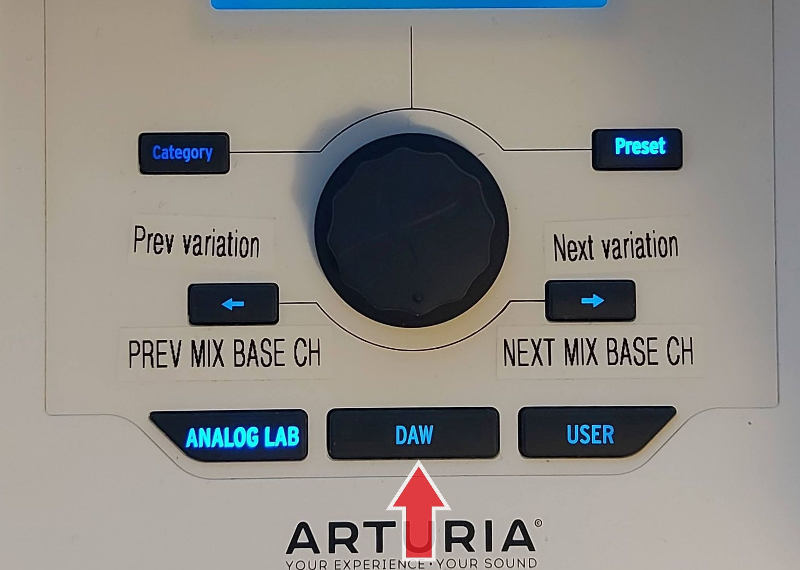

# Mapping between the Arturia DAW Command Center and Reason

:warning: the `Arturia KeyLab MKII Control` surface must be locked to the Reason Master Section to work properly.

_Some relabelling of magnetic overlays (as shown in images) is highly recommended._

####These controls are always active, regardless of which hardware mode button (DAW or Analog Lab) you have selected.

| Arturia DAW Command Center | Reason Command | Comment |
| -------------------------- | -------------- | ----------------------- |
| Stop | Stop | Stops playback. Pressing two time will return the playback cursor to the start of the track. |
| Pause/play | Play | Starts and pauses your track at the current position of the playback cursor. In pause mode, the stop button LED is on and the pause/play button LED is slightly on |
| Record | Record On/off | Arms the record function in Reason. Hitting the Record button while the track is stopped will begin playback while recording. If the track is already playing, hitting Record will begin recording from the current playback cursor position. |
| Loop | Loop On/off | Toggles the Loop function on and off. The loop zone is set within Reason transport section or with Jog dial. |
| Rewind | Rewind | Quickly moves the playback cursor backward. |
| Fast forward | Fast Forward | Quickly moves the playback cursor forward. |
| Save | Target track enable Monitor |  Enable monitoring in currently active track. If track monitor is off, the button's led is off |
| In | Auto Quantize |  Enable Auto quantize. If Auto quantize is off, the button's led is off |
| Out | Precount On/Off | Toggles Reason’s metronome precount on and off. |
| Metro | Click On/Off | Toggles Reason’s metronome click on and off. |
| Undo | Undo  | Reverses your last action. If there is no action, the button's led is off |
| Solo | Solo select mode | ** |
| Mute | Mute select mode | ** |
| Record | Record select mode | Record select mode not used at the moment |
| Read | Reset Automation Overrides | Reset Automation Overrides |
| Write | Target Track Automation write enable | enables/disables automation write mode in targeted track. If Auto write is off, the button's led is off|

**(Press MUTE or SOLO button in the DAW COMMANDS section, then press the desired track SELECT buttons below the faders to mute or solo multiple tracks. Note this only works in DAW mode. Remember to toggle OFF Mute or SOLO button once done.)

## Mapping with Reason when using the Arturia keyboard DAW map

Activate DAW map on Arturia MKII keyboard, press `DAW` button.

| Arturia Keyboard surface | Reason Command | Comment |
| -------------------------- | -------------- | ----------------------- |
| Jog dial | Loop locators/Song position | jog dial rotation is used to change the position of locators. Press the jog dial to cycle between controlling individual loop locators, both loop locators at the same time, or the song position pointer (playhead cursor). |
| Left Arrow | Prev 8 Remote Base Channel | To select the prev 8 remote channels that will be controlled at a given time |
| Right Arrow | Next 8 Remote Base Channel | To select the prev 8 remote channels that will be controlled at a given time |
| Master fader| Master Section level | Change the Master Section level |
| Encoder <1-8> | Channel <1-8> Pan | Which group of 8 channels are controlled is determined by the "Remote base channel" selected |
| Fader <1-8> | Channel <1-8> Level | Which group of 8 channels are controlled is determined by the "Remote base channel" selected |
| Fader 9 | Master bus level | Controls the volume of the master bus |
| Encoder 9 (chorus) | CTRL out level | Controls the volume of the CRTL room output. (useful if "CTRL room out" is patched to Audio I/O "Sampling Input"). |
| Part 1/Next | Prev Sequencer track | To select the previous sequencer track |
| Part 2/Prev | Next Sequencer track | To select the next sequencer track |
|Select <1-8>|SOLO/MUTE|Press MUTE or SOLO button in the DAW COMMANDS section, then press the desired track SELECT buttons below the faders to mute or solo multiple tracks. Remember to toggle OFF Mute or SOLO button once done.|

:warning: the `Arturia KeyLab MKII Control` surface must be locked to the Reason Master Section to work properly
