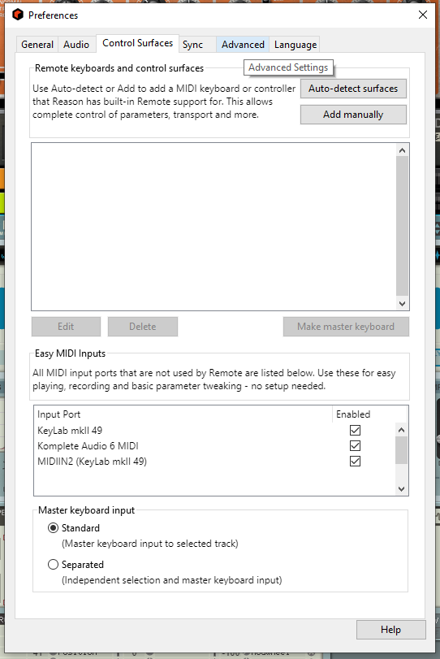
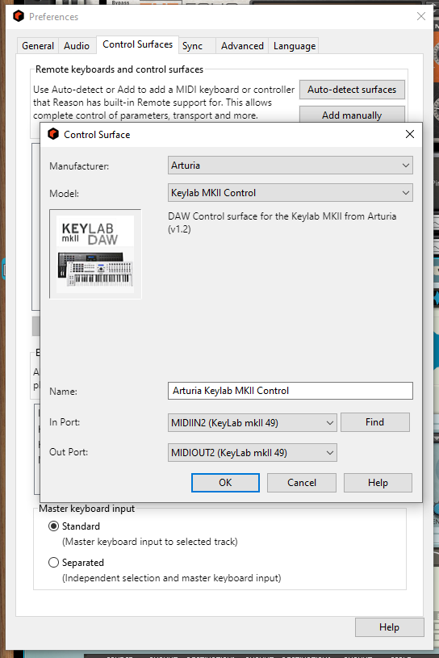
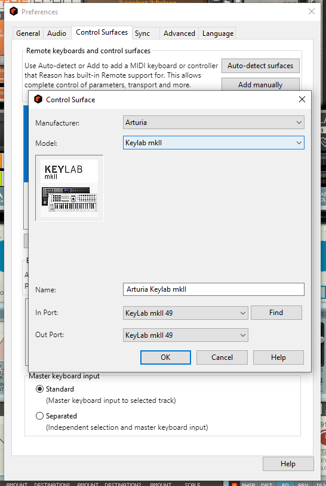
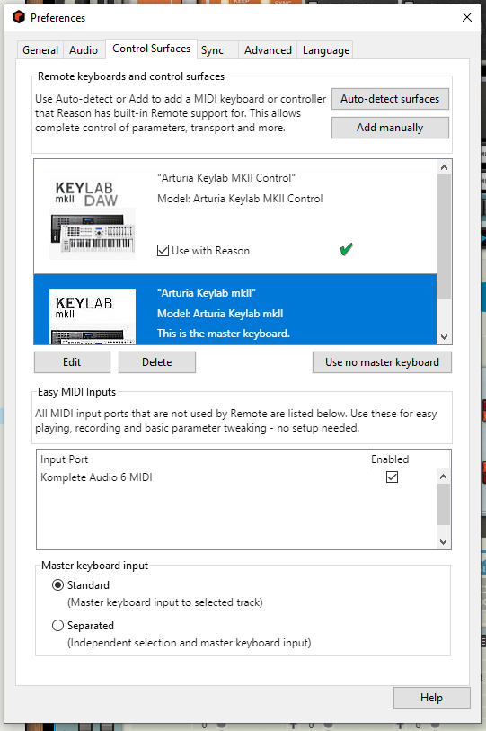
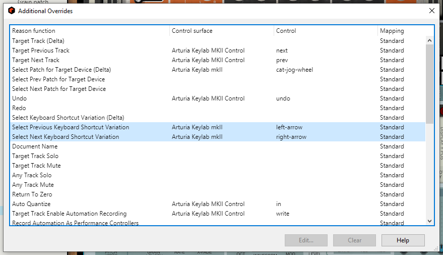
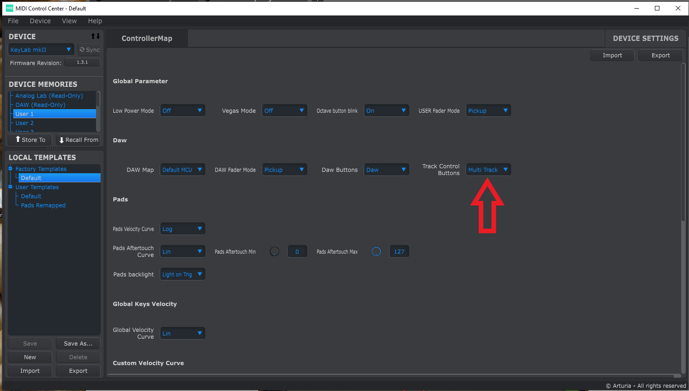
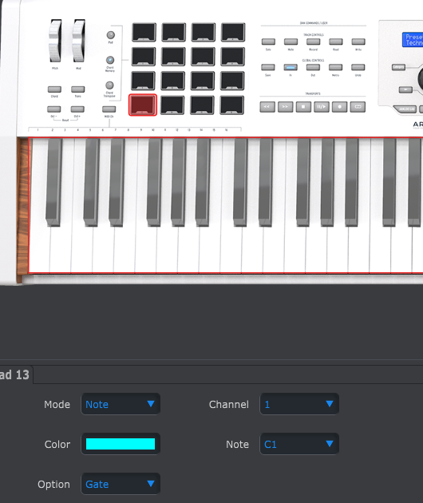

# Reason remote scripts for Arturia Keylab MKII

Remote is the Propellerheadʼs protocol for communication between hardware control surfaces and Reason Studios' [Reason](https://www.reasonstudios.com/en/reason) application. This project provides Reason remote scripts for the **DAW COMMANDS** and **TRANSPORTS** sections of the Arturia Keylab MKII keyboard and the **keyboard** itself (pads, encoders and faders sections).


How the knobs, faders, and center command dial will function depends on which hardware mode button **(DAW** or **ANALOG LAB)** is active. We do not make use of use the **USER** hardware mode.


## Installation

### :one: Install the scripts

To install the Remote scripts in your environment, the files in the `Remote` directory should be copied to your Propellerhead installation directory:

		*.Remote files go in the 'Maps' folder, Arturia subfolder
		*.LUA, *.LUAcodec, and *.PNG files go in the 'LUA codecs' folder, Arturia subfolder

* On MacOS

```bash
Macintosh HD/Library/Application Support/Propellerhead Software/Remote
```

* On Window 7 and above

```bash
C:/ProgramData/Propellerhead Software/Remote
```

### :two: Setup the Arturia Keylab MKII DAW as a control surface in Reason

* Open the Preferences dialog and click the Control Surfaces tab.



* To add manually the control surface, click the “Add manually” button. This brings up a new dialog.
* Select "Arturia Keylab MKII Control" from the Model pop-up menu. Select **`MIDIIN2 (KeyLab MKII)`** for `In Port` attribute and **`MIDIOUT2(Keylab MKII)`** for `Out Port` .



### :three: Setup the Arturia Keylab61 MKII keyboard as a control surface in Reason

* Open the Preferences dialog and click the Control Surfaces tab.
* To add manually the control surface, click the “Add manually” button. This brings up a new dialog.
* Select "Arturia Keylab MKII" from the Model pop-up menu. Select **`Keylab MKII`** for `In Port` attribute and **`Keylab MKII`** for `Out Port` attribute.
* optional: select `Arturia KeyLab MKII` as the master keyboard



:exclamation: At that point you should have 2 new control surfaces:

* `Arturia KeyLab MKII Control` map to **_MIDIIN/OUT2 (KeyLab MKII)_** ports.
* `Arturia KeyLab MKII` map to **_Keylab MKII_** in and out ports and defined as master keyboard



### :four: Keyboard Shortcut Variations

To change which keyboard shortcut variation is selected in Reason using the Arturia keyboard, use the left and right Arrows while in "Analog Lab" mode.

At his point these 2 controls should already be mapped as shown below.



See [Reason doc](http://docs.propellerheads.se/reason10/wwhelp/wwhimpl/js/html/wwhelp.htm#context=EngOpManProjectPro&topic=PreferencesControlSurface) for more information

### :five: Surface Locking


Open the `Options` menu and choose `surface locking`.


Choose `keylab MKII` from the `surface` dropdown menu.

Choose `Master Section (Master Section)` from the `Lock to Device` drop down menu.

### :six: Hardware settings in Arturia MIDI control center
Set your keyboard's track control buttons to `MULTI` in Arturia MIDI control center *"Device settings"* tab. This ensures the MUTE and SOLO buttons function properly in Reason's SSL4000 mixer.



_________________

:exclamation: It is recommended to map the pads of your keyboard from C1 to D#2 in the *"Controller Map"* tab, Otherwise they will not function properly with KONG.



____________________
## Mapping between Arturia control surfaces and Reason

* [DAW commands & Master Section mapping](./daw-mapping.md)
* [Instruments mapping](./instruments-mapping.md)
* [Effects mapping](./effects-mapping.md)
* [Utilities mapping](./utilities-mapping.md)
* [Players mapping](./players-mapping.md)
