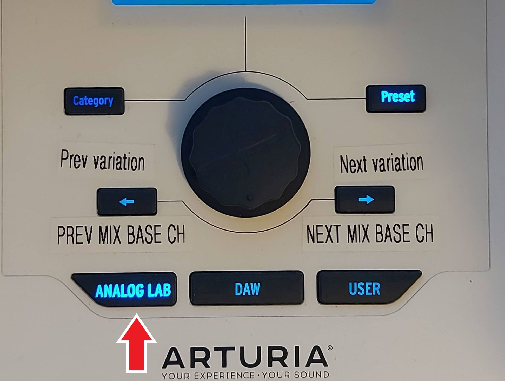
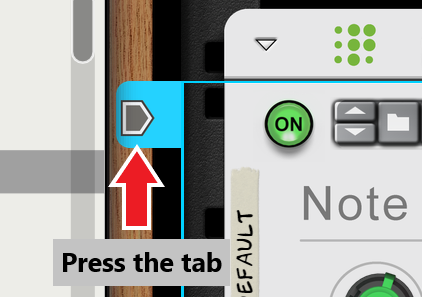
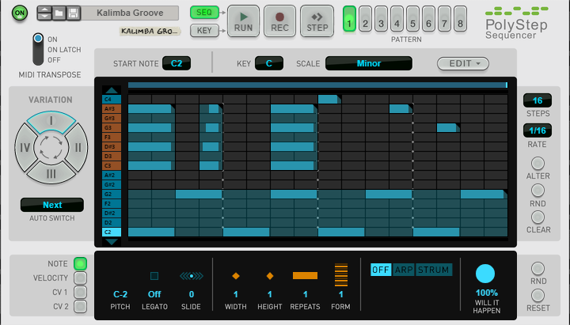
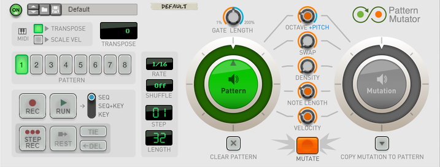
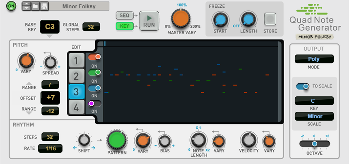

# Player Devices mapping

### _Keyboard  "Analog Lab" mode button activated._

____________________________________

* [Scales & Chords](#mapping-with-scales--chords)
* [Note Echo](#mapping-with-note-echo)
* [Dual Arpeggio](#mapping-with-dual-arpeggio)
* [Drum Sequencer](#mapping-with-drum-sequencer)
* [Beat Map](#mapping-with-beat-map)
* [PolyStep Sequencer](#mapping-with-polystep-sequencer)
* [Pattern Mutator](#mapping-with-pattern-mutator)
* [Quad Note Generator](#mapping-with-quad-not-generator)
* [Bassline Generator](#mapping-with-bassline-generator)

**note: player devices will need to have a sequencer track created and targeted before they can be remotely controlled or automated.**

## Mapping with Scales & Chords

The first line of the Arturia Keyboard LCD should display "Scales & Chords" and the second one, the name of the selected patch.

| Arturia Keyboard surface | Reason Command | Comment |
| -------------------------- | -------------- | ----------------------- |
| Encoder 1 | Key | scale key |
| Encoder 2 | Scale | 14 scale modes |
| Encoder 3 | Notes | 1-5 notes per chord |
| Encoder 4 | Inversion | 0-4 chord inversions |
| live / bank | alter |  |
| Jog Wheel | Select Previous/Next Preset | when "Preset" is selected |

## Mapping with Note Echo

The first line of the Arturia Keyboard LCD should display "Note Echo"and "(1-9)" or "(10-17)" depending on which variation mode is active. The second line displays the name of the selected patch.

| Arturia Keyboard surface | Reason Command | Comment |
| -------------------------- | -------------- | ----------------------- |
| live / bank | Tempo sync toggle |  |
| Encoder 1 | Step Length Free |  |
| Encoder 2 | Step Length Synced |  |
| Encoder 3 | Repeats |  |
| Encoder 4 | Velocity |  |
| Encoder 5 | Pitch |  |
| Fader 1-9 | Step <0-9> enable | When variation `Step 1-9` is active |
| Fader 1-9 | Step <10-17> enable | When variation `Step 10-17` is active
| Left/right arrow | Change active variation group |
| Jog Wheel | Select Previous/Next Preset | when "Preset" is selected |

## Mapping with Dual Arpeggio

The first line of the Arturia Keyboard LCD should display "Dual Arpeggio" and the second one, the name of the selected patch.

| Arturia Keyboard surface | Reason Command | Comment |
| -------------------------- | -------------- | ----------------------- |
| Encoder 1 | Low Key 1 |  |
| Encoder 2 | High Key 1 |  |
| Encoder 3 | Rate 1 |  |
| Encoder 4 | Octaves 1 |  |
| Encoder 5 | Direction 1 |  |
| Encoder 6 | Shift Step 1 |  |
| Encoder 7 | Transpose 1 |  |
| Encoder 8 | Gate Length 1 |  |
| Fader 1 | Low Key 2 |  |
| Fader 2 | High Key 2 |  |
| Fader 3 | Rate 2 |  |
| Fader 4 | Octaves 2 |  |
| Fader 5 | Direction 2 |  |
| Fader 6 | Shift Step 2 |  |
| Fader 7 | Transpose 2 |  |
| Fader 8 | Gate Length 2 |  |
| Jog Wheel | Select Previous/Next Preset | when "Preset" is selected |

## Mapping with Drum Sequencer

The first line of the Arturia Keyboard LCD should display "Drum Sequencer" and the second one, the name of the selected patch.

| Arturia Keyboard surface | Reason Command | Comment |
| -------------------------- | -------------- | ----------------------- |
| Master pan | Pattern Select |  |
| Jog Wheel | Select Previous/Next Preset | when "Preset" is selected |

## Mapping with Beat Map

The first line of the Arturia Keyboard LCD should display "BeatMap" and the second one, the name of the selected patch.

| Arturia Keyboard surface | Reason Command | Comment |
| -------------------------- | -------------- | ----------------------- |
| Encoder 1 | Kick Density |  |
| Encoder 2 | Snare Density |  |
| Encoder 3 | Kick Mirror Velocity |  |
| Encoder 4 | Snare Mirror Velocity |  |
| Encoder 5 | Hat Density |  |
| Encoder 6 | Perc Density |  |
| Encoder 7 | Hat Mirror Velocity |  |
| Encoder 8 | Perc Mirror Velocity |  |
| Jog Wheel | Select Previous/Next Preset | when "Preset" is selected |

## Mapping with Polystep Sequencer

The first line of the Arturia Keyboard LCD should display "PolyStep" and the second line, the name of the current patch.

| Arturia Keyboard surface | Reason Command | Comment |
| -------------------------- | -------------- | ----------------------- |
| Master pan | Pattern Select |  |
| Jog Wheel | Select Previous/Next Preset | when "Preset" button is active |

## Mapping with Pattern Mutator

The first line of the Arturia Keyboard LCD should display "Pattern Mutator" and the second line, the name of the current patch.

| Arturia Keyboard surface | Reason Command | Comment |
| -------------------------- | -------------- | ----------------------- |
| Master pan | Pattern Select |  |
| Jog Wheel | Select Previous/Next Preset | when "Preset" button is active |

## Mapping with Quad Note Generator

The first line of the Arturia Keyboard LCD should display "Quad Note" and the second line, the name of the current patch.

| Arturia Keyboard surface | Reason Command | Comment |
| -------------------------- | -------------- | ----------------------- |
| Encoder 1 | Master Vary | |
| Encoder 2 | Freeze Start | |
| Encoder 3 | Freeze Length | |
| Jog Wheel | Select Previous/Next Preset | when "Preset" button is active |

## Mapping with Bassline Generator

The first line of the Arturia Keyboard LCD should display "Bassline" and "P<1-8>" Current pattern that the controls will operate. It is possible to modify knobs on an inactive pattern, then switch to it afterwards with the jog dial.
The second line of the LCD should display the current patch name.

Use left and right arrows to change control variations.

| Arturia Keyboard surface | Reason Command | Comment |
| -------------------------- | -------------- | ----------------------- |
| Encoder 1 | OnBeat Source|The green line in the center matrix. Typically, lower numbers will be less dense patterns|
| Encoder 2 | OffBeat Source|The blue line in the center matrix. Typically, lower numbers will be less dense patterns|
| Encoder 3 | OffBeat Velocity||
| Encoder 5 | OnBeat Note Length||
| Encoder 6 | OffBeat Note Length||
| Fader 1 | OnBeat Variator Shape||
| Fader 2 | OffBeat Variator Shape||
| Fader 3 | OnBeat Variator Amount||
| Fader 4 | OffBeat Variator Amount||
| Fader 5 | Note Range||
| Fader 6 | Minorness||
| Master pan | Select Previous/Next Pattern | when "Preset" button is active. note: does NOT change the active variation which the controls are set to operate.|
| Jog Wheel | Select Previous/Next Preset | when "Preset" button is active |
| Left Arrow | Select previous Keyboard Variation | To change which Bassline pattern the controls are set to operate |
| Right Arrow | Select next Keyboard Variation | To change which Bassline pattern the controls are set to operate |
