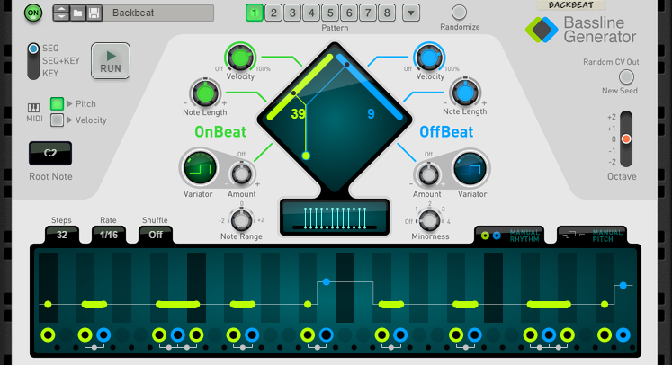

# Players mapping

* [Scales & Chords](#mapping-with-scales--chords)
* [Note Echo](#mapping-with-note-echo)
* [Dual Arpeggio](#mapping-with-dual-arpeggio)
* [Drum Sequencer](#mapping-with-drum-sequencer)
* [Beat Map](#mapping-with-beat-map)

## Mapping with Scales & Chords

The first line of the Arturia Keyboard LCD should display "Scales & Chords" and the second one, the name of the selected patch.

| Arturia Keyboard surface | Reason Command | Comment |
| -------------------------- | -------------- | ----------------------- |
| Encoder 1 | Key |  |
| Encoder 2 | Scale |  |
| Encoder 3 | Notes |  |
| Encoder 4 | Inversion |  |
| Jog Wheel | Select Previous/Next Preset | when "Preset" is selected |

## Mapping with Note Echo

The first line of the Arturia Keyboard LCD should display "Note Echo" and the second one, the name of the selected patch.

| Arturia Keyboard surface | Reason Command | Comment |
| -------------------------- | -------------- | ----------------------- |
| Encoder 1 | Step Length Synced |  |
| Encoder 2 | Repeats |  |
| Encoder 3 | Velocity |  |
| Encoder 4 | Pitch |  |
| Jog Wheel | Select Previous/Next Preset | when "Preset" is selected |

## Mapping with Dual Arpeggio

The first line of the Arturia Keyboard LCD should display "Dual Arpeggio" and the second one, the name of the selected patch.

| Arturia Keyboard surface | Reason Command | Comment |
| -------------------------- | -------------- | ----------------------- |
| Encoder 1 | Low Key 1 |  |
| Encoder 2 | High Key 1 |  |
| Encoder 3 | Rate 1 |  |
| Encoder 4 | Octaves 1 |  |
| Encoder 5 | Direction 1 |  |
| Encoder 6 | Shift Step 1 |  |
| Encoder 7 | Transpose 1 |  |
| Encoder 8 | Gate Length 1 |  |
| Fader 1 | Low Key 2 |  |
| Fader 2 | High Key 2 |  |
| Fader 3 | Rate 2 |  |
| Fader 4 | Octaves 2 |  |
| Fader 5 | Direction 2 |  |
| Fader 6 | Shift Step 2 |  |
| Fader 7 | Transpose 2 |  |
| Fader 8 | Gate Length 2 |  |
| Jog Wheel | Select Previous/Next Preset | when "Preset" is selected |

## Mapping with Drum Sequencer

The first line of the Arturia Keyboard LCD should display "Drum Sequencer" and the second one, the name of the selected patch.

| Arturia Keyboard surface | Reason Command | Comment |
| -------------------------- | -------------- | ----------------------- |
| Master pan | Pattern Select |  |
| Jog Wheel | Select Previous/Next Preset | when "Preset" is selected |

## Mapping with Beat Map

The first line of the Arturia Keyboard LCD should display "BeatMap" and the second one, the name of the selected patch.

| Arturia Keyboard surface | Reason Command | Comment |
| -------------------------- | -------------- | ----------------------- |
| Encoder 1 | Kick Density |  |
| Encoder 2 | Snare Density |  |
| Encoder 3 | Kick Mirror Velocity |  |
| Encoder 4 | Snare Mirror Velocity |  |
| Encoder 5 | Hat Density |  |
| Encoder 6 | Perc Density |  |
| Encoder 7 | Hat Mirror Velocity |  |
| Encoder 8 | Perc Mirror Velocity |  |
| Jog Wheel | Select Previous/Next Preset | when "Preset" is selected |

## Mapping with Bassline Generator

The first line of the Arturia Keyboard LCD should display "BasslineGeneratr" and the second line, "Pattern # var." the Bassline pattern that the controls will operate. It is possible to modify knobs on an inactive pattern, then switch to it afterwards with the jog dial.

Use left and right arrows to change control variations.

| Arturia Keyboard surface | Reason Command | Comment |
| -------------------------- | -------------- | ----------------------- |
|pan-1|OnBeat Source|The green line in the center matrix. Typically, lower numbers will be less dense patterns|
|pan-2|OffBeat Source|The blue line in the center matrix. Typically, lower numbers will be less dense patterns
|pan-3|OffBeat Velocity|
|pan-5|OnBeat Note Length|
|pan-6|OffBeat Note Length|
|fader-1|OnBeat Variator Shape|
|fader-2|OffBeat Variator Shape|
|fader-3|OnBeat Variator Amount|
|fader-4|OffBeat Variator Amount|
|fader-5|Note Range|
|fader-6|Minorness|
| Jog Wheel | Select Previous/Next Pattern | when "Preset" button is active. note: does NOT change the active variation which the controls are set to operate.|
| Left Arrow | Select previous Keyboard Variation | To change which Bassline pattern the controls are set to operate |
| Right Arrow | Select next Keyboard Variation | To change which Bassline pattern the controls are set to operate |
